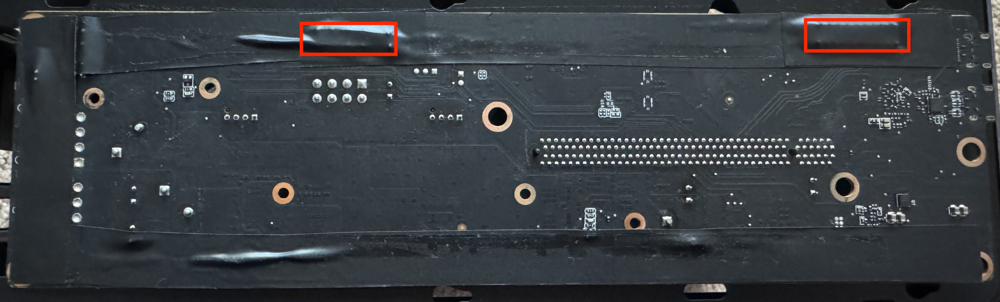

The dock was designed from the beginning to be assembled at JLCPCB because of their low cost PCB assembly option. If you have not ordered from JLCPCB before, this guide will help you get started. There are two configurations you can build and some minor differences between them. The regular configuration is designed to be a complete replacement for the XG Station Pro main board and requires its proprietary power connector. It also supports USB charging and a 2-port USB hub. The lite version requires a standard ATX power supply and passes through the USB port to an external connection.

## Board Guide

1. Download `GERBER-XG_Mobile_Dock[_Lite].zip`, `CPL-XG_Mobile_Dock[_Lite].csv`, and `BOM-XG_Mobile_Dock[_Lite].csv` from the [latest release on GitHub](https://github.com/osy/XG_Mobile_Station/releases). Choose the regular or lite variant depending on the build you want. Do not mix and match files.
2. Visit https://cart.jlcpcb.com/quote and upload `GERBER-XG_Mobile_Dock[_Lite].zip`
3. Fill the PCB options as follows

    | Option                     | Value                   | Notes                                                           |
    |----------------------------|-------------------------|-----------------------------------------------------------------|
    | Base Material              | FR-4                    |                                                                 |
    | Layers                     | 4                       |                                                                 |
    | Dimensions                 |                         | Should be auto filled                                           |
    | PCB Qty                    | Any                     |                                                                 |
    | Product Type               | Industrial/Consumer     |                                                                 |
    | Different Design           | 1                       |                                                                 |
    | Delivery Format            | Single PCB              |                                                                 |
    | PCB Thickness              | 1.6                     |                                                                 |
    | PCB Color                  | Any                     | Green is cheapest                                               |
    | Silkscreen                 | White                   |                                                                 |
    | Material Type              | **FR-4 TG155**          |                                                                 |
    | Surface Finish             | **ENIG**                | HASL (with lead) can be used in low volume runs for cost saving |
    | Outer Copper Weight        | 1 oz                    |                                                                 |
    | Inner Copper Weight        | 0.5 oz                  |                                                                 |
    | Specify Layer Sequence     | No                      |                                                                 |
    | Impedance Control          | **Yes**                 |                                                                 |
    | Layer Stackup              | **JLC04161H-7628**      |                                                                 |
    | Via Covering               | Plugged                 |                                                                 |
    | Min via hole size/diameter | 0.3mm/(0.4/0.45mm)      |                                                                 |
    | Board Outline Tolerance    | ±0.2mm(Regular)         |                                                                 |
    | Confirm Production file    | No                      |                                                                 |
    | Remove Order Number        | No                      |                                                                 |
    | Flying Probe Test          | Fully Test              |                                                                 |
    | Gold Fingers               | No                      |                                                                 |
    | 30° finger chamfered       | No                      |                                                                 |
    | Castellated Holes          | No                      |                                                                 |
    | Press-Fit Hole             | No                      |                                                                 |
    | Edge Plating               | No                      |                                                                 |

4. Check PCB Assembly and fill the following options

    | Option                  | Low Volume      | High Volume     | Notes                                  |
    |-------------------------|-----------------|-----------------|----------------------------------------|
    | PCBA Type               | Economic        | **Standard**    | Economic saves on per-component cost   |
    | Assembly Side           | Both Sides      | Both Sides      | Lite only needs top side               |
    | PCBA Qty                | >= 2            | >= 100          |                                        |
    | Edge Rails/Fiducials    | Added by JLCPCB | Added by JLCPCB |                                        |
    | Confirm Parts Placement | No              | No              |                                        |

5. Press Continue or Next
6. Accept the board preview and press Next
7. Click "Add BOM File" and select your `BOM-XG_Mobile_Dock[_Lite].csv`
8. Click "Add CPL File" and select your `CPL-XG_Mobile_Dock[_Lite].csv`
9. Press "Process BOM & CPL" to continue (ignore any error about missing data)
10. Select the parts to pick by following the [Parts Guide](#parts-guide) section below.
11. Press Next. If you chose to skip some parts you will get a confirmation pop-up where you can press "Do Not Place".
12. In the Component Placements screen, you can confirm the parts orientation. If there are any mis-rotated parts, click them and rotate it to the correct orientation. (e.g. the pin headers.) Press Next to continue.
13. Confirm the order details and for "Product Description" select "Reserch\Education\DIY\Entertainment -> DIY - HS Code 902300"
14. Press "Save to Cart".

### Power Cable
If you are building the standard variant, you also need to build a custom power cable. This will be a second board in your cart. You do not need this if you are building the lite variant and can proceed to checkout.

1. If you are in the Cart page, press "+ Add new item", otherwise visit https://cart.jlcpcb.com/quote again
2. Upload `GERBER-Riser_M.zip`
3. Optionally change the quantity (you need two for each board) and keep all other options default
4. Press "Save to Cart" and proceed to checkout.

## Parts Guide

### Ordering Parts
Some parts may not be currently available in JLCPCB. This will be indicated with a red "xxx shortfall" text under the select column or they may appear on the bottom under unmatched parts. For each unavailable, part you need to manually order the part before you can order the assembled boards. It will typically take a few days to two weeks for the parts to arrive at JLCPCB.

1. Locate the part number. If this is a shortfall part, click the row and then select "Part Info". Copy the "MFR.Part #". Also note the number required in the "Qty" column. This is the minimum number you need to buy. It may not always be possible to buy the exact number, so you may end up with extra parts. If this is an expensive part and you are cost conscious, consider buying some number of PCBs to get the number of missing parts to be an exact amount you can buy for all the missing parts. This will increase your total cost but decrease your per-unit cost.
2. Order the Order Parts page: https://jlcpcb.com/user-center/smtPrivateLibrary/orderParts
3. You have a choice between JLCPCB Parts or Global Sourcing Parts. JLCPCB Parts is recommended for cost and ease but not all parts will be available.
4. First, try to search in JLCPCB Parts: paste the part number and search. If there are multiple results, click the one with the exact match on the part number. You will either see a box to type in the quantity or "Unavailable".
5. If the part is available, type in the Qty from step 1 or the minimum shown above the box depending on which number is larger. Then click "Add to My Part Lib" and you can stop here and proceed with the next part. Once you have all the parts added, you can skip to part 8.
6. If the part is unavailable, you will need to visit [Global Sourcing Parts](https://jlcpcb.com/user-center/smtPrivateLibrary/orderParts). Search for the part number found in step 1.
7. You will be presented with a list of distributors. Some of these will be mismatches, check the number in bold above each table of distributors. This must be an exact match with your part number. Note the "Distributor Part #" may not match but that is okay. Each distributor has a minimum order quantity and a unit price breakdown. The easiest way to find the cheapest distributor is to enter your desired Qty from step 1 into each text box and look at the "Ext. Price" which is automatically calculated. Once you select a distributor, add the component to your cart. You can now repeat these steps for other missing parts.
8. Once you have all the missing parts added, visit the [Parts Cart](https://jlcpcb.com/user-center/smtPrivateLibrary/orderParts) and checkout your "JLCPCB Parts" and/or your "Global Sourcing Parts".

### Cost Reduction
If you are ordering a low quantity (2-5 units) of PCBA boards and don't mind doing a bit of manual soldering with a heat gun or reflow oven, here's some tips you can follow.

* Choose Economic PCBA with Top Side for the lowest cost
* You can manually solder the capacitors on the bottom side
* Some "Extended" components incur a $3/component fee. For certain parts, this fee exceeds the cost of the components and so it may be cheaper to purchase these parts yourself and manually solder them. Some of these "Extended" components are actually "Preferred" and do not incur this cost.
* Some parts are unavailable at JLCPCB and will require pre-ordering or purchasing from Global Sourcing Parts which usually come with a handling fee and a minimum order quantity. It may make sense to purchase these yourself and manually solder them. This makes sense especially for the more expensive ICs where you can buy it cheaper from AliExpress than Global Sourcing Parts.
* If you do not need the USB charger and hub, you can exclude much of the components supporting those and significantly reduce costs.

## Additional Parts
* [XG Mobile connector cable](https://www.a-accessories.com/asus-connection-cable-62505-79153.htm)
* (Standard build only) SPI flasher is needed to program the firmware for the TI PD charger. You can also use a RaspberryPi with [Flashrom](https://wiki.flashrom.org/RaspberryPi) for this purpose.
* ST-LINK v2 is needed to program the STM32 MCU. You can buy a cheap clone from AliExpress for under $10 but note that the pinout listing printed on the dongle may be incorrect.
* (Standard build only) 22AWG stranded PVC insulated wire
* (Standard build only) [10mm diameter cable sleeve](https://www.amazon.com/dp/B0CPJ7PMFZ)
* (Standard build only) Electrical tape (100°C rating)

## Building Firmware
Check the [readme](../README.md) for directions on flashing.

### MCU
To build the MCU, you need an GCC ARM toolchain. The easiest way is to install [Homebrew](https://formulae.brew.sh) and run `brew install --cask gcc-arm-embedded`. Then you can run `make` in the `XG_Mobile_Dock_MCU` directory to build the MCU firmware.

Alternatively, if you want to build and develop the firmware, the easiest way is to install Visual Studio Code and the [STM32 extension](https://marketplace.visualstudio.com/items?itemName=bmd.stm32-for-vscode). Then you can open the project directory and run build and debug commands from the IDE.

### TI PD Controller (standard build)
1. Download the [TPS65982 Configuration Tool](https://www.ti.com/tool/TPS6598X-CONFIG) and install it.
2. Project -> Load Project and select "xg_mobile_dock_charger.pjt". This will load the settings for this board.
3. Binary -> Save Binary and check "Full Binary Image"
4. Click "Change File" and save it as "XG_Mobile_Dock_Charger.bin".
5. Press Ok and Ok to save the firmware image.
6. Some flashers like Flashrom requires the image to be the same size as the flash device. You can run `dd if=/dev/zero of=XG_Mobile_Dock_Charger.bin bs=1 seek=1048575 count=1 conv=notrunc` to ensure this.

## Building Power Cable
For the standard build, we need to build a custom cable assembly to pass power from the replacement board to the original board which we need to use to power the GPU.

Warning: this cable will be handling 16.9A at 19.5V so please follow these instructions carefully and make sure to test your cable for short circuits and bad solder joints before plugging it in.

1. Cut out 20 pieces wire, each one 25cm long. We chose 22AWG stranded wire because of the flexibility and their ability to handle 2.1A of load.
2. For each wire, using a wire stripper on only one end, remove no more than 3mm of insulation
3. Cut the cable sleeve into a 22cm long piece
4. Bundle up all 20 wires and feed it through the cable sleeve. Feed the unstripped end to avoid tangling the conductor with the sleeve. If you are using different coloured wires, make sure to group the same colours together before feeding it to make organizing it easier later.
5. After feeding all the wires through, strip the other end of each wire (no more than 3mm)

Now you need to solder both ends of the connector using the custom PCB we ordered. Notice that one side is labeled "Front". We need to connect the same pin to each side of the wire. It may be difficult to determine both ends of a single wire, so we recommend using a multimeter's connectivity test to find the opposite end. We recommend starting on one side and alternating between the first pin and last pin, then second pin and second-to-last pin, and so on working towards the middle. This way, the tension of the cable is more evenly distributed.

Finally, secure one end with electrical tape to prevent the sleeve from fraying. Then, on the other end, twist the connector 180° such that one end faces the front and the other end faces the back. Secure that end with electrical tape as well.

## Building XG Mobile Station
The standard build is designed to fit inside the XG Station Pro enclosure. We will be replacing the logic board with our custom board, mounting the original logic board to the top of the case with electrical tape, and finally connecting the two boards with our custom power cable. This will allow us to use the original board to provide 12V power to the GPU. Note that we will be removing the fans to create more space as well as leave a larger power budget for the GPU.

To start, completely disassemble the XG Station Pro until you have just the metal frame.

Take the original logic board and insulate the edge with electrical tape. Because we will be mounting this board onto the top of the frame, we need to protect against short circuits. Note two areas highlighted in red which has high current. We recommend using two layers of electrical tape here just for extra protection.

Secure the custom PCB and screw it in. You may want to also put the extra screws into the empty holes to not lose them. Plug in the power connector board and screw that in as well. Remove the EMI shielding from the top of the USB-C connectors of the original board and place it on the USB-C connectors of the custom board.

Connect the PCIe power cable back on the original board and connect the 2-pin power LED to the end of the board. Flip the board upside down and use electrical tape to secure it to the top of the chassis. Make sure that the holes for the top panel is not blocked by the board or any tape.

Connect the XGM cable to the board (all three connectors). You will need to fold the cable in order to feed the XGM end through the PCIe slot. Secure the cable in place with the screw terminal on the board.

Connect the custom power cable to both boards. Make sure that the front of the connector is **facing towards the PCIe connector on both boards**.

Connect the PCIe 12V power to the GPU and seat the GPU. Note that you may need to modify the back I/O shield of the GPU in order to create space for the XGM cable to extend outside the case. Alternatively, you can try to pass the XGM cable above the GPU I/O or you can drill a hole next to the power connector.

Now you can reassemble the rest of the case. If you have issues closing the front panel because of GPU clearance issues, do not screw in the PCIe slot until after you close the front panel.
