This project was the culmination of many months of work reverse engineering hardware, reverse engineering software, designing hardware, designing software, and lots of debugging on all parts of the stack. By documenting the journey and all the mistakes made and dead ends, hopefully it can save someone else some time in the future.

## Origins
The inception of this project came from the discovery of the [ROG Flow X13 schematics](https://www.badcaps.net/forum/troubleshooting-hardware-devices-and-electronics-theory/troubleshooting-laptops-tablets-and-mobile-devices/schematic-requests-only/103946-asus-gv301qc) which contains the pinout listing of the XG Mobile connector and the [ASUS parts store](https://www.a-accessories.com/asus-connection-cable-62505-79153.htm) which sells the XG Mobile cable individually. We can build a custom board to connect the XGM port to a standard PCIe slot or an OCuLink connector.

[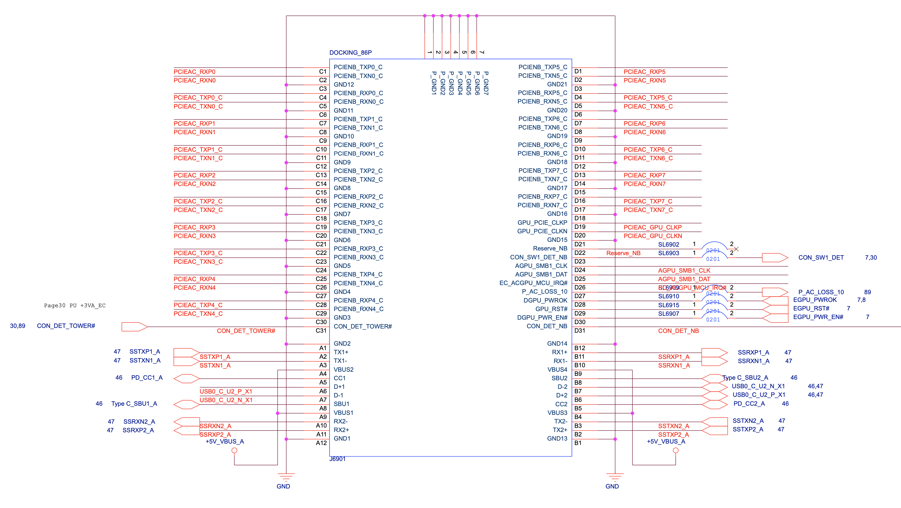](images/connector_schematics.png)

However, there is a problem: the other end of the XGM cable are three proprietary board connectors (an 8-pin and two 40-pin). 

[.jpg)](https://images.anandtech.com/galleries/7883/Connector%20(3).jpg)

[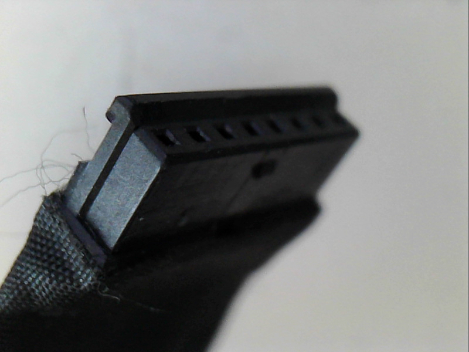](images/8_pin_connector.jpg)

The 8-pin was easy enough to find. It was a rectangular pin connector with a specific pitch width and pin size. After some searching on Digikey and Mouser as well as popular connector brands' sites, we found it was a match for [5-1775443-8](https://www.te.com/en/product-5-1775443-8.html).

Finding the part number for the 40-pin took a bit of internet sleuthing. The first lead with from the [parts site listing for the 40-pin connector](https://www.a-accessories.com/asus-attach-system-40-pins-87588-67468.htm) which had the part number "12017-00181600". Searching for that on Google led to schematics for another ASUS product "ASUS X505BP REV2.0.pdf". Inside that schematics, we found the reference to that part number for something called "WTOB_CON_40P" and it carried eDP signals. That gave us the idea that this connector is repurposed from a high-speed display panel connector and we started searching Aliexpress for replacement display connectors with 40-pins. This led us to the [I-PEX CABLINE-VS](https://www.i-pex.com/product/cabline-vs) which precisely matches the photo.

Once it was confirmed that all the parts are standard and are easily available for purchase, the project to build a eGPU dock became tenable.

### Pin mapping
Before we can design the dock, we had to map the pins from the 86-pin XGM connector (which we have the schematics for) to the 2x 40-pin I-PEX connectors (which would mate with our custom board). This would require purchasing the cable and manually mapping the pins with a multimeter's connectivity mode.

After carefully taking the cable housing apart, we were met with a PCB which routed the 86-pin XGM connector to the cable's wires.

[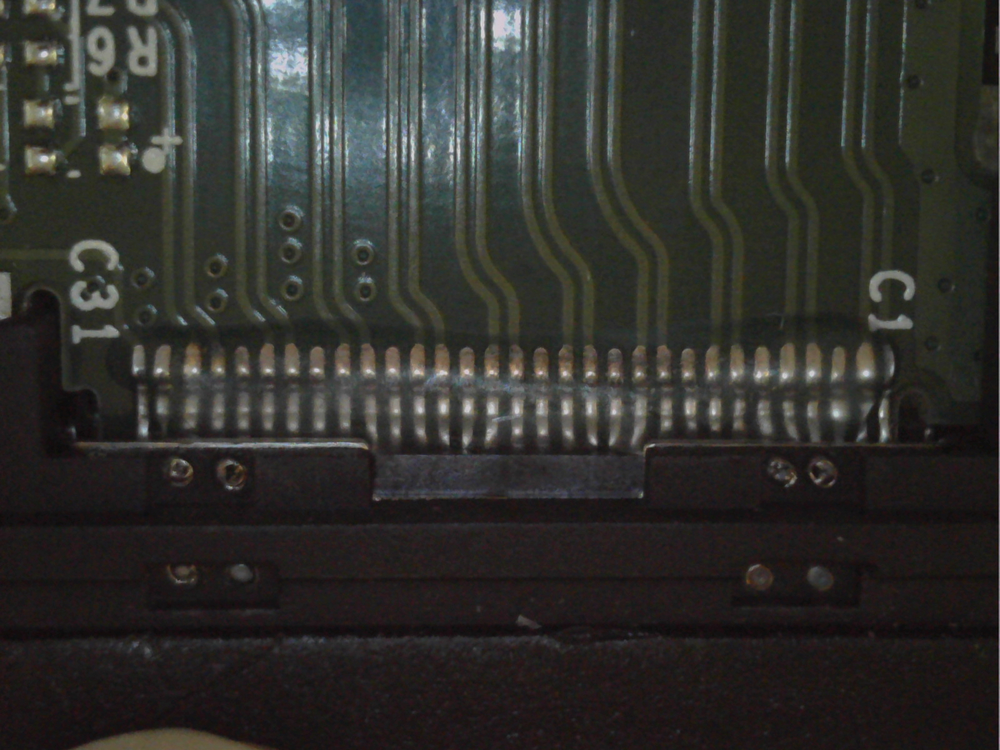](images/cable_pcb_1.jpg)
[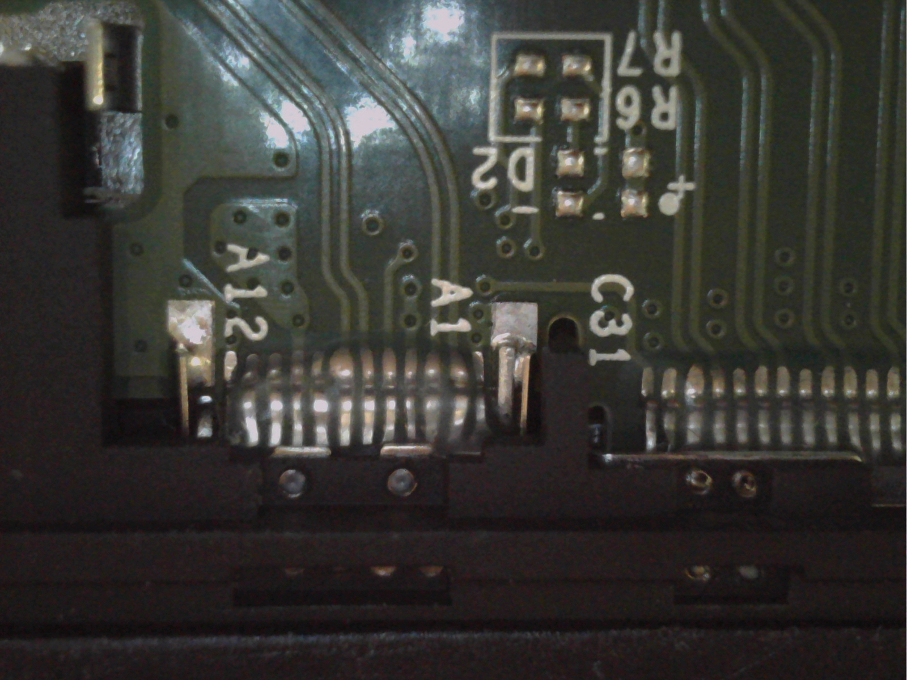](images/cable_pcb_2.jpg)
[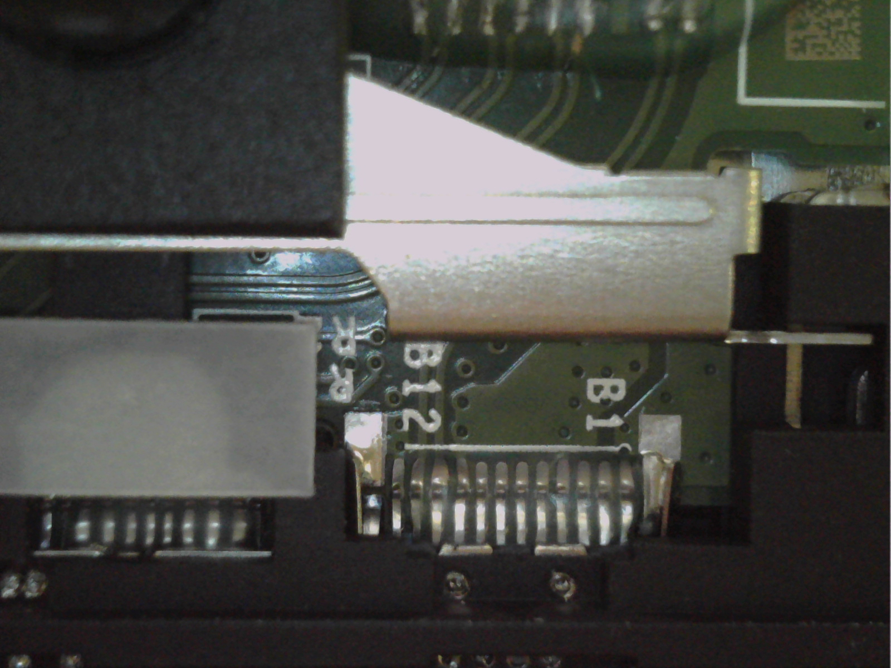](images/cable_pcb_3.jpg)
[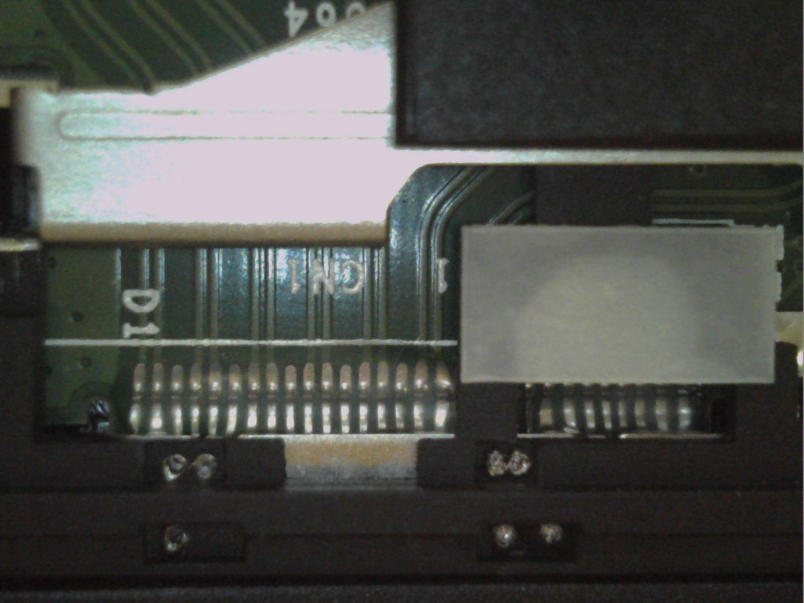](images/cable_pcb_4.jpg)
[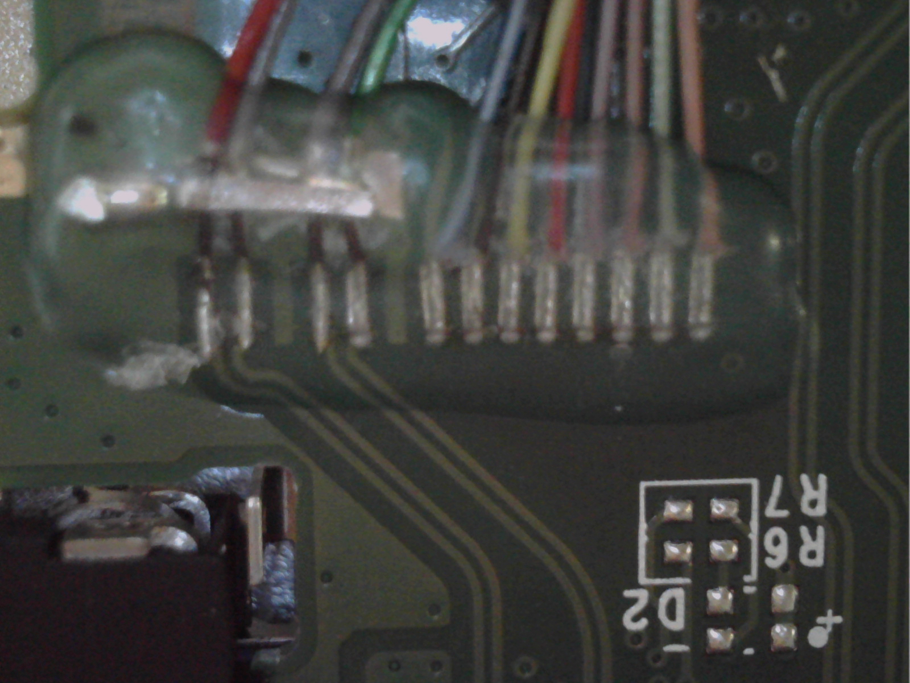](images/cable_pcb_5.jpg)
[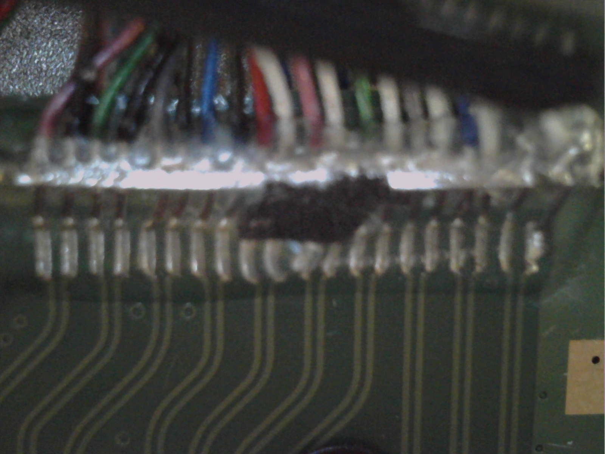](images/cable_pcb_6.jpg)
[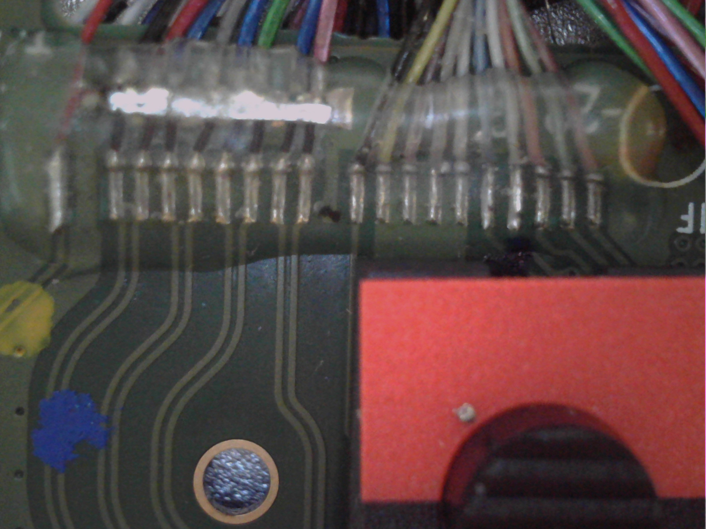](images/cable_pcb_7.jpg)
[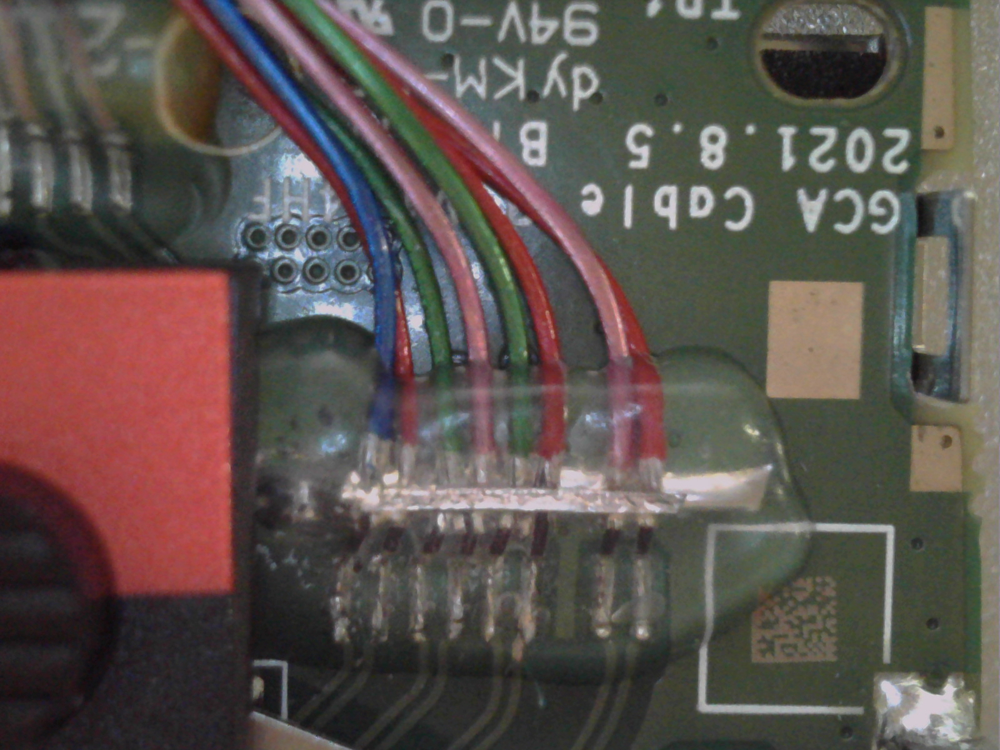](images/cable_pcb_8.jpg)

The glue which fortified the fragile wire connections had to be removed with some heat and then each pin can be traced to the wire and from the wire to the 40-pin connector. The pins on the 40-pin connector was extremely tiny, but a sewing needle taped to the probe of the multi-meter did the trick. The result was documented [here](Connector.md).

## XG Station Pro
In 2018, ASUS released the [XG Station Pro](https://www.asus.com/motherboards-components/external-graphics-docks/all-series/xg-station-pro/), a Thunderbolt 3 eGPU enclosure with a beautiful In Win designed case in a slim profile. 

For no reason other than because we want to repurpose this obsolete piece of hardware, we decided to design a replacement PCB that can interface with the XGM port. The idea is that we can take advantage of the included 330W power supply to power our board and also pass-through power to the original PCB as well. The original PCB will plug in at a right angle and drive the FETs which will power the PCIe graphics card as well as the fans and RGB lights.

[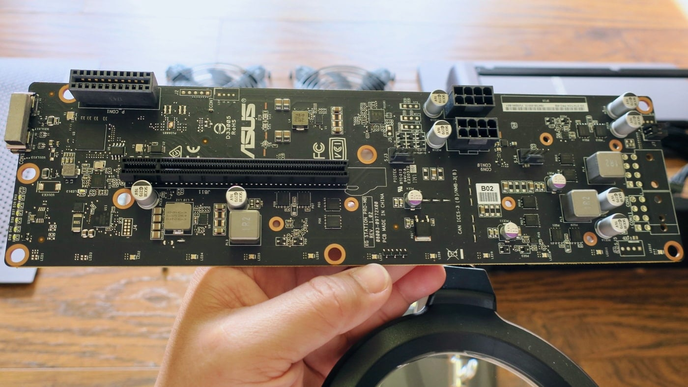](images/asus-xg-station-pro-main-tbt-board.jpg)
(Photo credits: [itsage](https://egpu.io/asus-xg-station-pro-review-cool-calm-collected/#comment-2453))

To get the positions of the screw holes correct, we used a digital caliper to get a rough measurement of the relative position of all the holes. Next, with trial and error, we printed out the PCB layout, compared the screw holes with a pencil outline, and made fine adjustments until all the holes lined up perfectly.

## Board Design
From the beginning, the goal is to make the board as cost effective as possible. We designed the board with intention of fabbing it at [JLCPCB](https://jlcpcb.com/help/article/98-PCB-Assembly-FAQs) because of their insanely low assembly costs. However, to take full advantage of the low costs, you are encouraged to use "Basic Components" from their parts library. These are parts which has already been loaded into their picker machines. Otherwise, you are charged an additional $3/part. For most resistors and capacitors, this is simple enough. For other components such as transistors, diodes, and the MCU, we try to find parts which are in their list of basic components. If no basic component are available, we looked for the cheapest part in their parts library.

### Rev. 1
We planned to design three circuits: the PCIe port with retimers, a USB 3.1 Gen 2 hub, and a 100W USB-PD charger. The reason for the hub and charger is because the XGM port takes away the only USB-C port on the ROG Ally. We chose the SN75LVPE4410 PCIe retimer because it was used on the ROG Flow X13 and therefore is "tested". For the USB hub, we chose the VL822-QFN76 because it is cheap and is in stock at JLCPCB. The USB-PD charger uses the TPS65987 because no other port controller on the market supports charger mode with data-role-swap (which allows the power-source to act as a data-sink). Since the retimer and USB-PD controller were TI chips, there is extensive amount of resources including sample designs and layout guidelines. That made designing those parts relatively easy. The VIA USB hub had no publicly available resources aside from a leaked early datasheet so we learned how to design with it by looking at [other projects online](https://oshwhub.com/lovetombseries/LoveTomb2).

[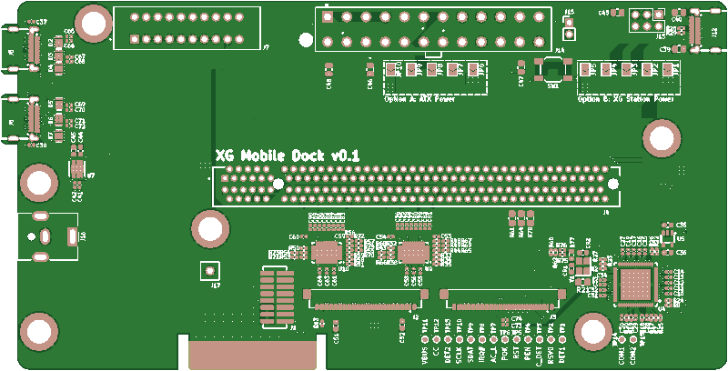](images/board_v1.png) [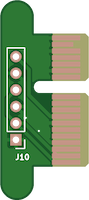](images/pci_leech.png)

The power delivery story for this board is rather complicated (for such a simple design). We needed to pass through 20V from the top connector to the bottom to power the external board, 12V and 3.3V for the PCIe connector, and 5V for the USB. In the first revision, to keep things simple, we decided to externally power everything. An ATX 20-pin connector was used for this purpose. We also tested an option that did not require an ATX power supply by attaching a "PCI leech" board for stealing 12V and 3.3V from the external board's PCIe connector and 5V from a USB port.

Unfortunately, this first revision was broken in many ways. First, the ATX 20-pin was wired up mirrored due to incorrect data in the footprint we downloaded. The retimer was wired up to the wrong pair (RX instead of TX) because of confusing naming in the schematics. We also didn't fully understand the purpose of the sideband signals in the XGM connector and so to be safe, we had pull-ups and pull-downs (unpopulated) for many signals. Finally, the PCI leech idea ended up not working so we were only able to use the ATX power supply (after manually wiring each pin mirrored).

When attached to the ROG Ally, it kept throwing "No Power" errors. After some reverse engineering [of the software](Software.md), we found that it needed to communicate with a USB HID device from the dock. Since that was unavailable, we had to trick the software into thinking there was power. However, that was still not enough as the "lock" status coming from one of the pins of the XGM connector was not being updated on the ROG Ally. We reverse engineered the [ACPI table](ACPI_Annotated.asl) to figure out how the "lock" status was being sent to the Armory Crate software and found there was a bug in the ACPI code which does not recognize when both the "connected" and "locked" pins are both asserted at the same time (in the real XG Mobile, it is always "connected" first, and then "locked" when the user engages the lock switch). This means that we cannot use simple pull-ups and pull-downs for the sideband signals and instead must implement a simple MCU which can control the sideband signals.

### Rev. 2-3
In rev 2, we removed the external power sources and implemented some proper buck converters for 12V, 5V, and 3.3V. We also implemented the USB PD charger circuit and to simplify the BOM (and picker costs), we used the same basic buck design for all four power circuits. We removed the PCIe retimers because they were expensive and because the ROG Ally did not include them on its motherboard and so having only retimers on one end is pointless (yes, the ROG Flow does use them and so having retimers would be useful for them). Finally, we added the STM32F030C8T6 MCU, which exists as a basic part on JLCPCB. The MCU required some pin headers for SWD programming and UART logging and the USB PD needs a SPI flash which also needs to be programmed. Slowly, this simple board got more complex...

There was still some big mistakes in this board. First of all, a mistake in the schematic drawing that was uncaught until now meant that the USB hub had its 1.2V and 3.3V shorted together (not good). Somehow, we *still* managed to mess up the PCIe TX and RX lanes by swapping them. What we thought was a clever shortcut in the resistor network (more on that later) to switch charging voltage for the USB PD charger did not work as expected. Finally, a last minute decision to silence DRC errors on the un-populated PCIe retimer circuit meant that we accidentally wired a 3.3V trace that was too thin to carry the current load. This thin trace just happened to be routed under the VBUS net and when an inrush current on 3.3V occurred during MCU programming, that trace burned up and shorted 12V to VBUS and in an instant destroyed an attached USB hub, a flash drive, and a keyboard. Luckily, the ROG Ally was fine because its USB circuit was properly designed to handle such a situation.

However, the bright side was that the MCU was working and the ROG Ally can show the XG Mobile pop-up after the right sideband signals was sent. A lot of trial and error led to [discovering the handshake sequence](Connector.md#connection-handshake). The USB hub was working as well. The PCIe still did not work because of the swapped lanes.

[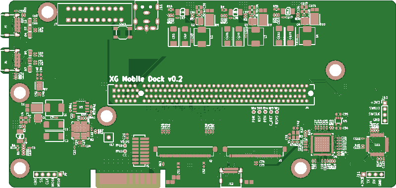](images/board_v2.png)

Rev 3 fixed the big mistakes and also removed the test pads that might have caused signal integrity issues. Additional sideband signals to control the external XG Station Pro board was wired to the MCU as well. Another mistake was made in wiring up the MOSFETs which replaced the resistor network for controlling the buck converter in rev 2 and so the USB PD charger could not be tested.

A side-note on the USB charger: To control the output voltage of the buck, a voltage divider is placed in a feedback network that is fed into the buck controller. In order to get variable voltages as required by the USB PD specifications, we program the TI PD controller to output a different GPIO signal for each selected PDO profile. Each GPIO controls a MOSFET which is connected to a resistor and affects the voltage divider value on it is turned on. In order to save costs, we wanted to only use resistor values that are in JLCPCB's basic component library. So, a Python script [was written](../resistor_finder.py) to brute force all possible sets of resistor values and return a set of resistors that had the least error on the output voltage. Miraculously, this worked.

Once the software workarounds was applied, the ROG Ally finally was able to recognize the PCIe graphics card! The RTX 3060 Ti was recognized but it threw an error 43 and no display was detected. Fortunately, this is a well known issue in eGPU world and the [workaround](https://egpu.io/nvidia-error43-fixer) is easy to use. With the workaround, we were able to get the display to work. But, fixing device detection on reboot took [another week of effort](MCU.md#embedded-controller).

### Rev. 4
This revision fixed the MOSFET issue and also switched the PCIe connector from through-hole to SMD which is both better for signal integrity and also makes the assembly cost much lower. An unexpected side-effect of the better signal integrity is that, without any additional changes, we are able to get PCIe 4.0 speeds!

[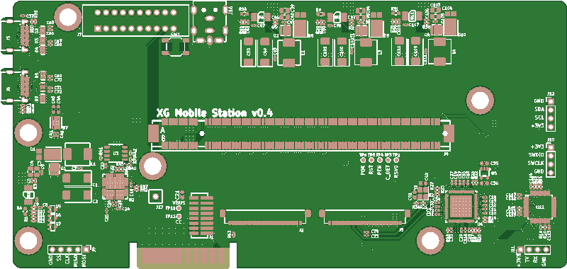](images/board_v4.png)

Through extensive testing, we found an issue with the USB PD circuit. If the external power is disconnected while the XGM connector is engaged, the +3V3 rail loses power and therefore the SPI flash loses power. The TI PD chip resets and draws power from the Ally. Since it is not able to read the firmware settings from SPI, it falls back to the default which is to negotiate a power sink role and now the Ally is powering the board. This is undesirable because it could drain the battery. The recommended layout from TI is that the SPI flash is powered by LDO_3V3 output from the TI chip and so we changed the design follow this recommendation.

Another issue discovered was that devices plugged into the USB hub would be disconnected after a few seconds and proceed to go into a detection and disconnect loop. When debugging this issue we found that the cause for this disconnect loop was the +1V0 rail was falling and then coming back up. This was an issue with the LDO and upon close reading of the data sheet we learned that it was overheating and going through thermal shutdown. Once the device cooled down, it reset, then overheats again, and so on. To confirm that overheating was the issue, we used some compressed air to cool the LDO during operation and found the disconnect issue no longer occurs spontaneously. However, when plugging in two devices, disconnection shows up again. We suspect that the LDO was also going into overcurrent protection as well. Since there was no public datasheet available for the VIA USB hub IC, we looked at schematics of other designs online and used a 300mA LDO because that is what others have used. However, upon measuring the current with an ammeter, we found that it can hit above 500mA at peaks. The final solution is to select a 1A LDO to handle the maximum current and we also chose a physically larger component which should have better heat dissipation. Finally, we increased the copper contact area under the LDO as well.

[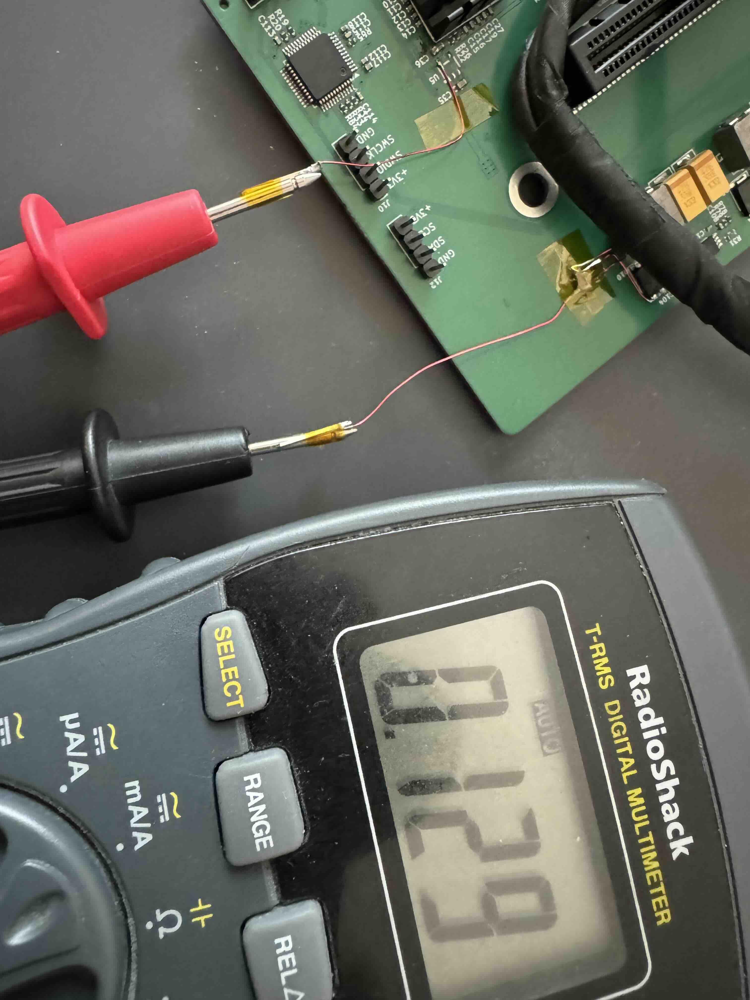](images/current_measure.jpg)

### Rev. 5
In addition to using a beefier LDO, we also connected a SPI flash to the VIA USB hub. Although the SPI flash was listed as optional in the datasheet, we found that USB 3.0 often caused errors in Windows and we hypothesized that the issue was due to outdated microcode that could be updated by a firmware stored in the SPI flash. We tested this by building a separate board with just the USB hub and confirmed this was indeed the fix.

[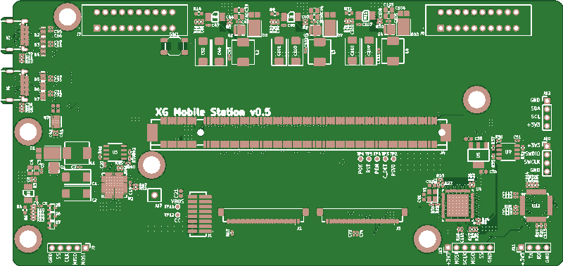](images/board_v5.png)

We also took the opportunity to reorganize the board layout. First, we moved the decoupling capacitors for the two USB ICs to the bottom layer. Previously, we avoided any components on the bottom layer for cost reasons but after observing the current consumption of the USB hub, we decided it would be safer to properly follow design recommendations and place the caps directly underneath the IC for better handling of sudden current spikes. This also means we have more space on top to follow other best practice guidelines such as putting Rbias and the crystal closer to the pads. Ultimately, the number of components on the bottom is quite small and can be manually soldered in small runs.

Since we no longer need to stuff all these components close to each other, we also were able to increase the minimum drill size from 0.15mm to 0.3mm. This introduces significant cost savings in manufacturing.

Finally, we moved the power passthrough from the bottom edge to a second connector on the top. Originally, we wanted to plug the original board directly into our board in a 90 degree orientation. This was awkward to manage and did not work with larger GPUs. Instead, a better way is to introduce a second 20-pin connector along with a custom passthrough cable.

[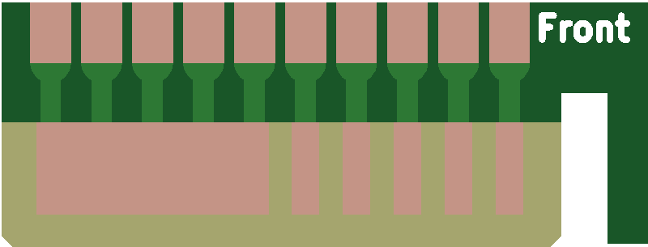](images/power_connector.png)

### Lite
By popular demand, we also introduced a "lite" variant of the board which is cost-optimized to work with the minimal number of components. We removed the USB ICs and associated power controllers and added an ATX-24 connector.

[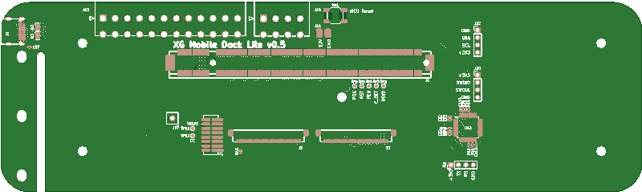](images/board_lite_v5.png)

We chose to match the form factor to the ADT-UT3G in order to be compatible with third party case designs.

### Rev. 6
Originally, we didn't design a 300W DC-DC power supply because of the increased complexity and opted to build a passthrough cable for the 20V connector in order to use the power circuit from the original board. While this had worked, we were not happy with the thermal performance because we had to remove the case fans to make room for the board. To avoid the need to test multiple iterations of a high wattage power supply, we took a shortcut once again and stole a [TI reference design](https://www.ti.com/tool/PMP10852). By using the same BOM and layout we avoided the need to do extensive testing on the design.

[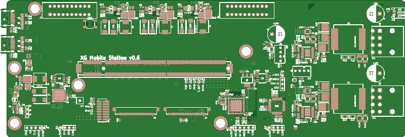](images/board_v6.png)

In addition to the power supply, we also added fan connectors and wrote a PWM driver in the microcontroller and support for the case LED. This means the board is now a complete replacement for the original and we no longer need the original board.

After testing the boards, there was some minor issues including hiccup mode in the over-current protection of the power supply. The controller disables the FETs until a timer expires during an over-current condition but because the GPU is using two supplies in parallel, it is acceptable for short periods of over-current on one supply (it should drop the voltage and the other supply will then ramp up).

## Final Build (rev. 4)
Originally, we wanted to fit a 2 slot GPU into the case, which meant we could have daisy chained the PCIe power PCB on the side. However, after getting a NVIDIA RTX 4070 Ti SUPER (a 2.7 slot card), we had to adapt the power connector. The solution was to make a [riser cable](../Power_Riser) for the power connector which allowed us to mount (tape) the power PCB to the top of the enclosure.

[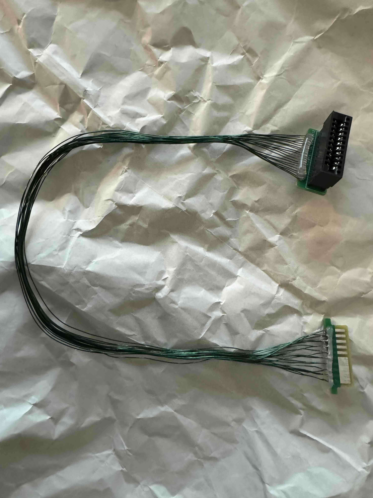](images/power_riser_cable.jpg)

Next, we tested the complete setup for stability before stuffing it into the enclosure.

[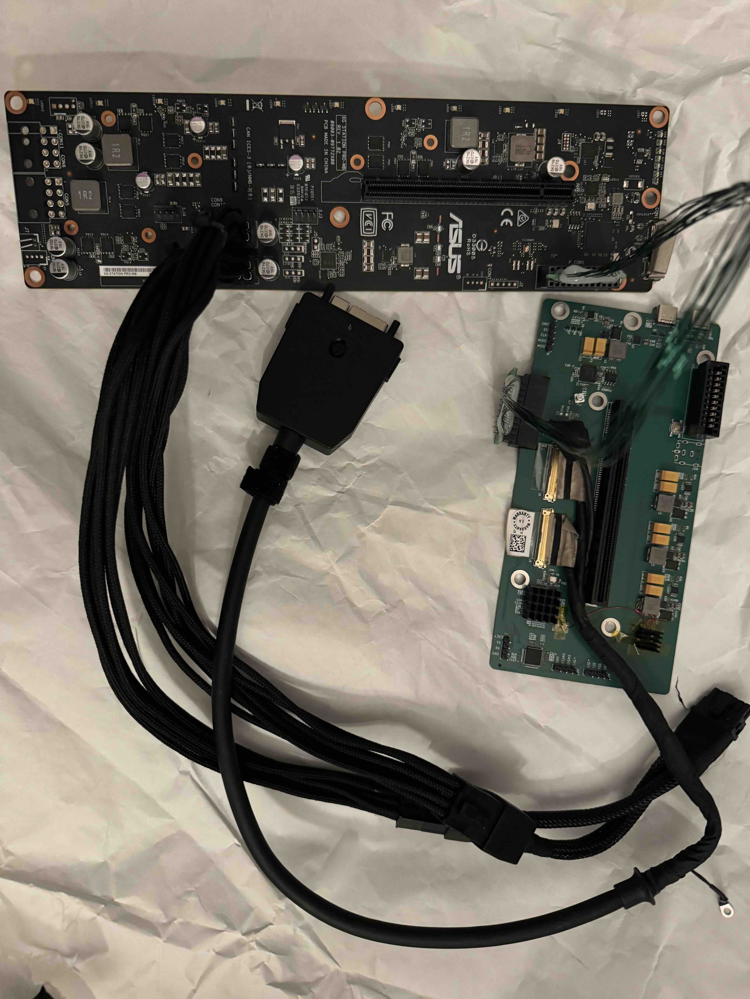](images/breakout.jpg)

On the top is the original XG Station Pro PCB which we use to drive the two 8-pin PCIe power connectors that goes into a single 12-pin adapter for the GPU. On the right is the XG Mobile Station rev. 4 board with some modded fixes for the USB overheating issue (we re-wired a larger LDO and stuck on a heat sink for both the LDO and the USB IC). These two are connected by the power riser cable so the 20V power supply can be passed from the custom board to the original board.

[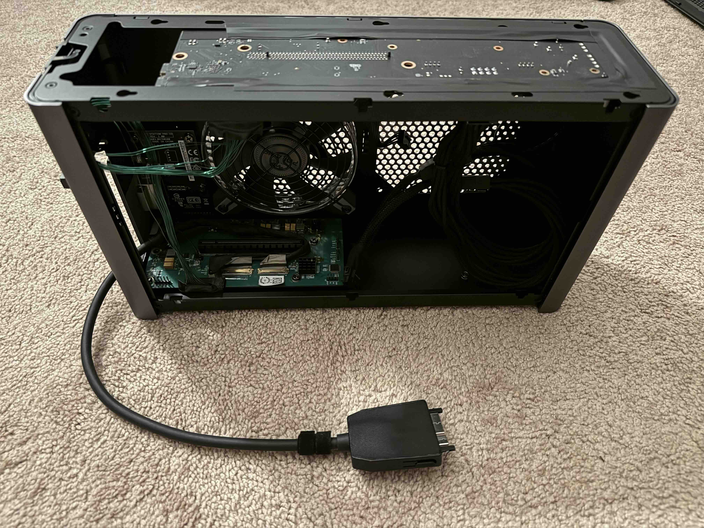](images/completed_no_gpu.jpg)

After doing some stability testing with FurMark and making sure we didn't start any fires with the custom riser cable that can carry 16.5A of current, we fitted the custom board to where the original board used to sit and then with electrical tape, we moved the original board to the top of the case and connected the two with the riser cable.

[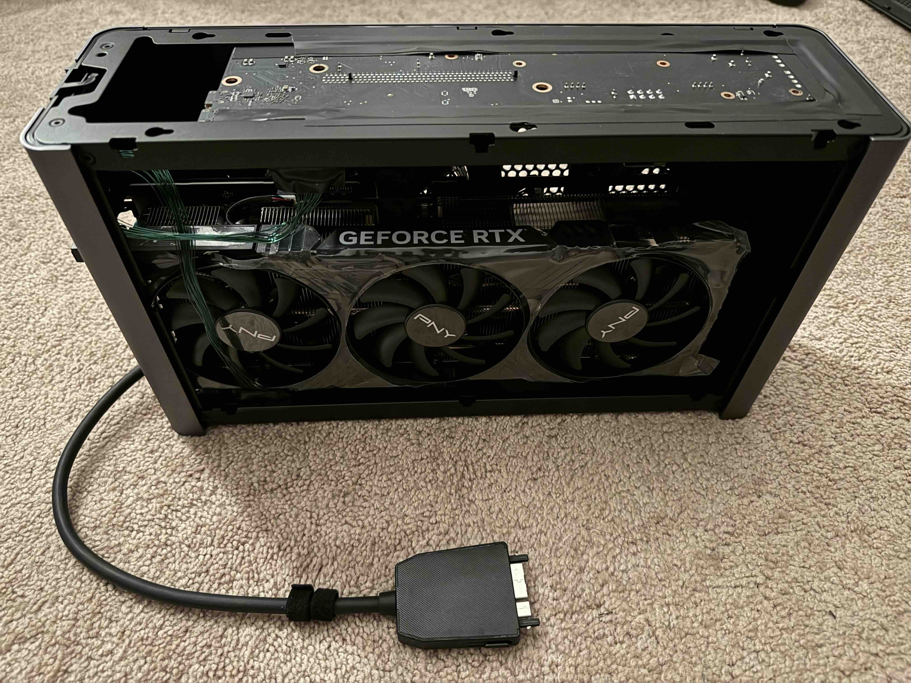](images/completed_gpu.jpg)

The GPU sits snugly inside the enclosure. Due to a design limitation of the XG Station Pro case, it does not fit a 2.7 slot bracket even though it fits a 2.7 slot card. That means the mounting bracket had to be removed which unfortunately means that the card is sitting loose on the PCIe slot and can cause damage if it was ever tipped over.

[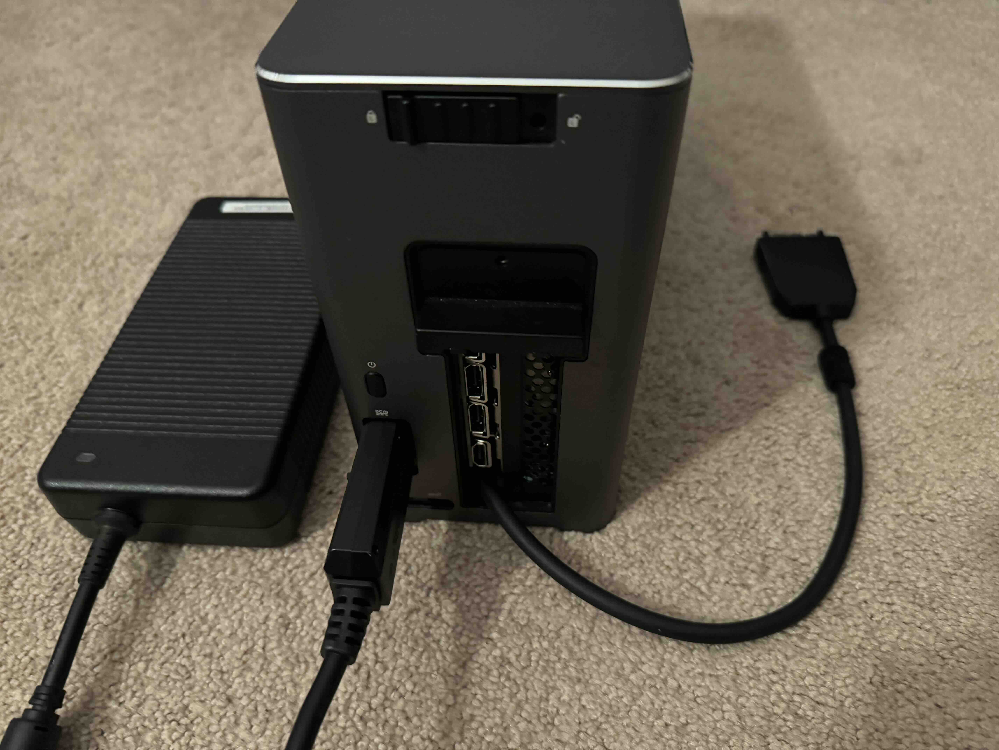](images/completed_back.jpg)
[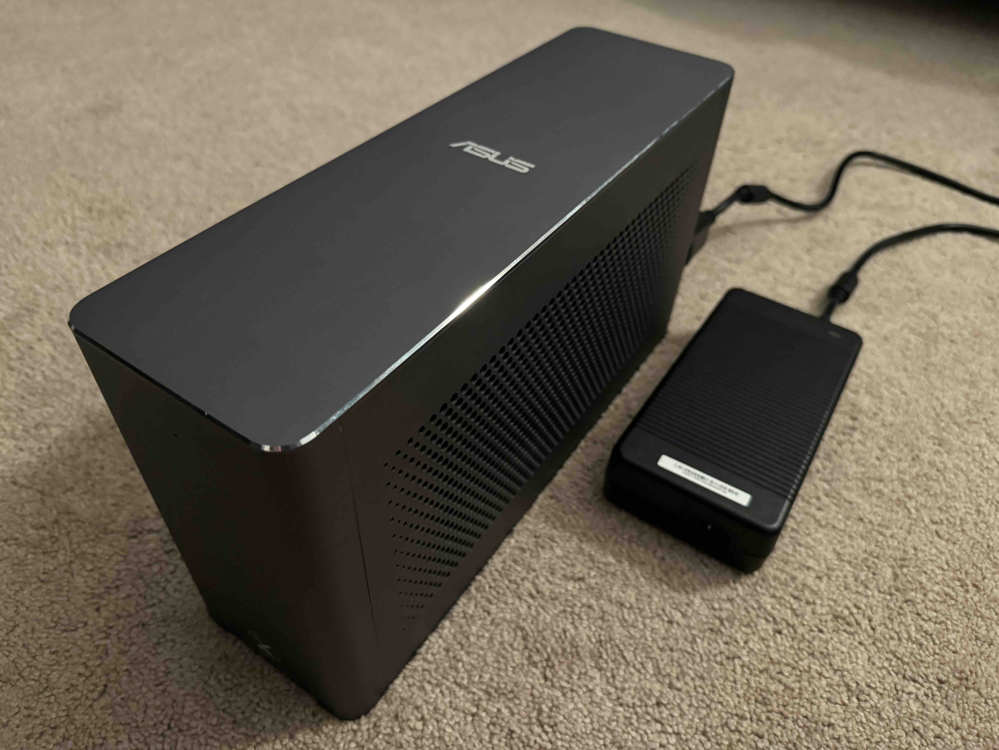](images/completed_side.jpg)

The last part of this build was to find a replacement mounting bracket which can accommodate the case as well as the XGM cable.

[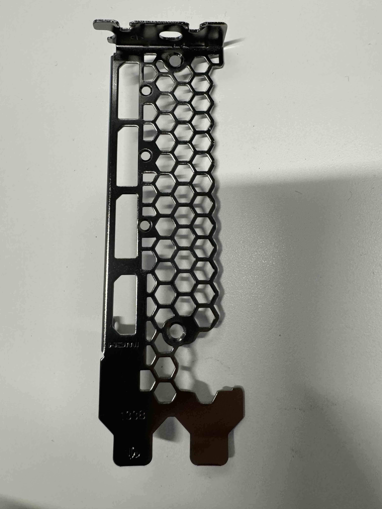](images/io_shield.jpg)

We removed the bracket from a PNY 3050 because it had the same mounting screws as the 4070 Ti SUPER. Next, we used pliers to remove the right side (which protruded a little) and create a hole large enough to fit the XGM cable.

[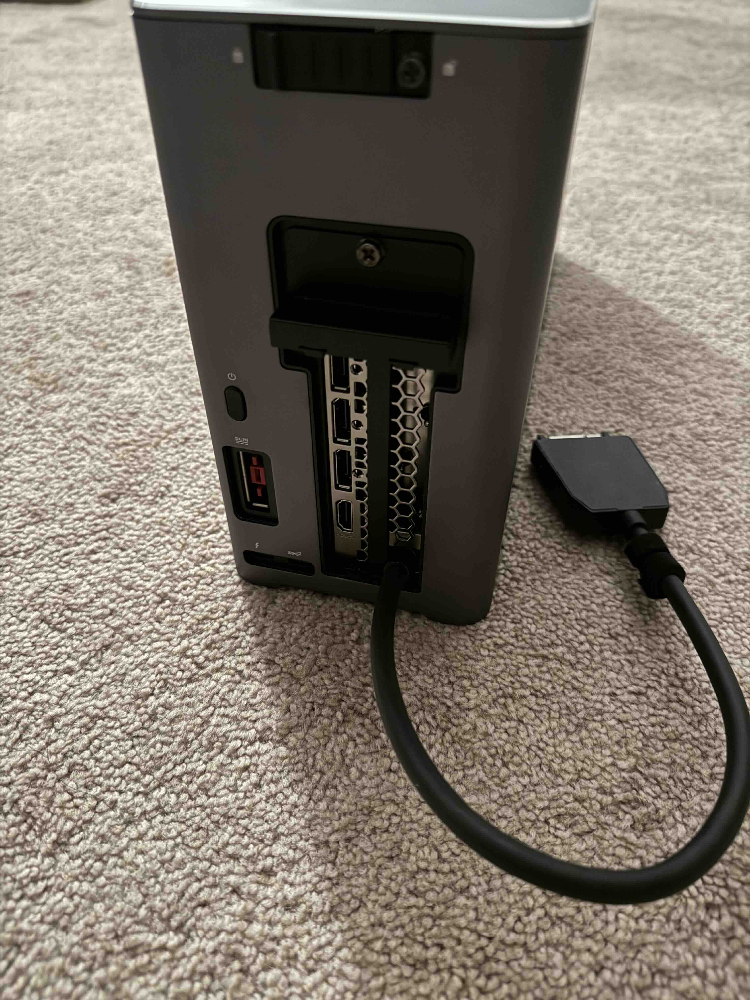](images/final_back.jpg)

With the mounting bracket installed, the GPU fits securely inside the enclosure and the cable is also protected against accidental pulls.

## Final Build (rev. 6)
We weren't happy with the solution in rev. 4 which required mounting the original logic board in order to steal the 12V DC-DC converter and not have to design our own. The heat output from the GPU made it hard for the board to stick to the top of the case with electrical tape. Additionally, there was no room to mount the case fans and the top mounted board impeded airflow even more. As a result, we decided to bite the bullet and add our own 2x 150W @ 12V DC-DC power supply along and a PWM fan controller as well. The final design of rev. 6 is now a complete logic board replacement.

[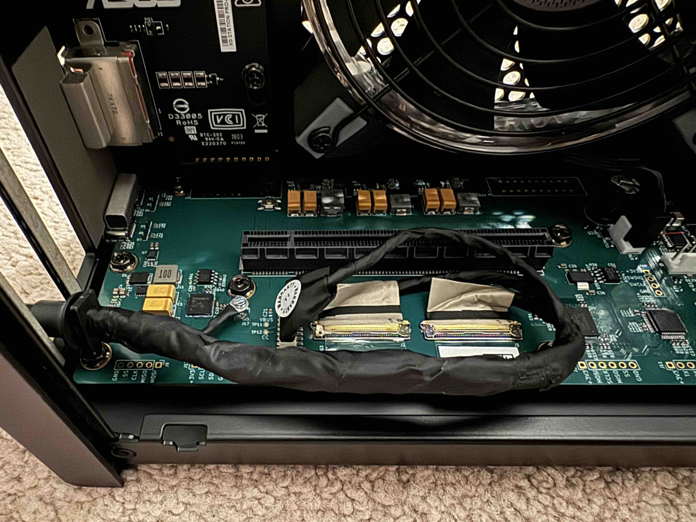](images/rev_6_installed_cable.jpg)

[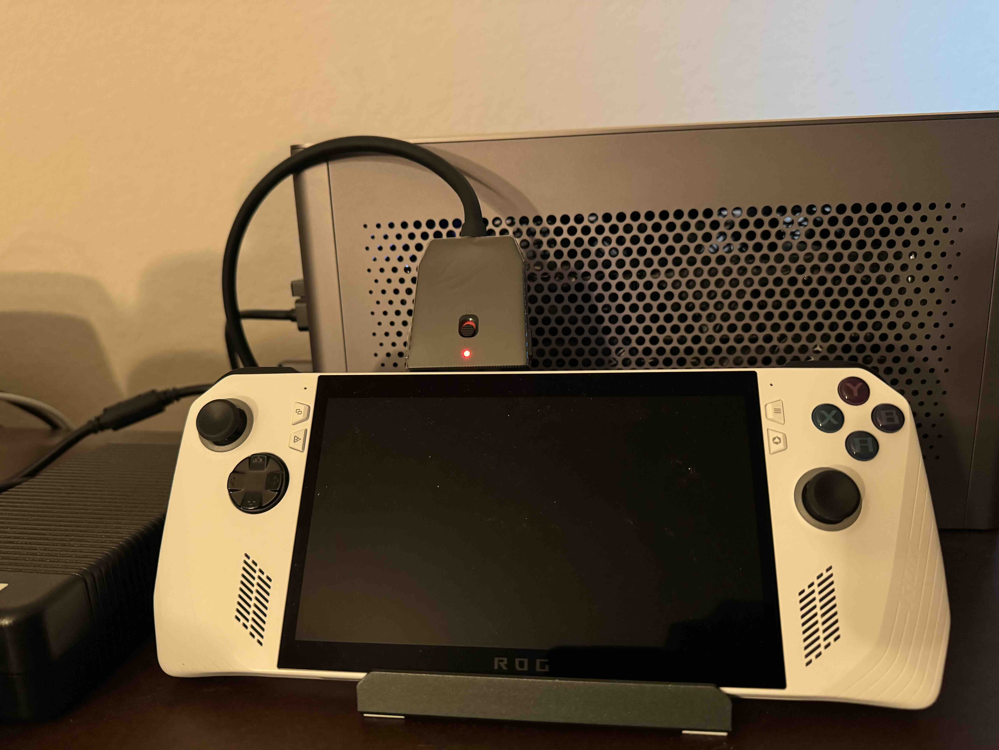](images/rev_6_completed.jpg)

Here is a box of all the various revisions that we tested:

[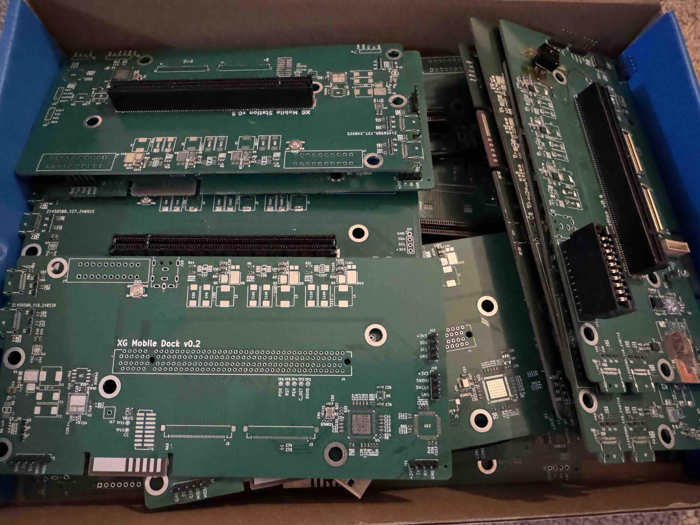](images/box_of_waste.jpg)

### Performance
We are able to get PCIe 4.0 x4 speeds meaning that it will perform similar to an OCuLink x4 setup.

[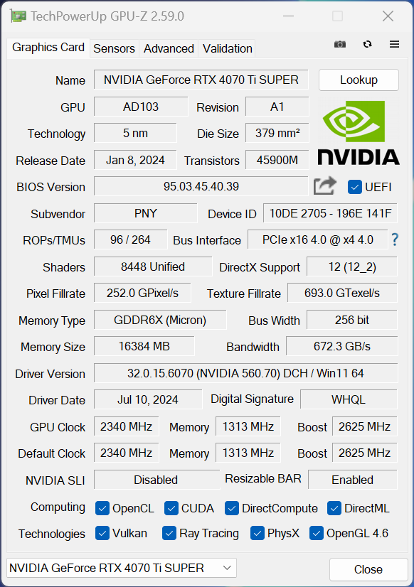](images/gpuz_4070_ti_super.png)
[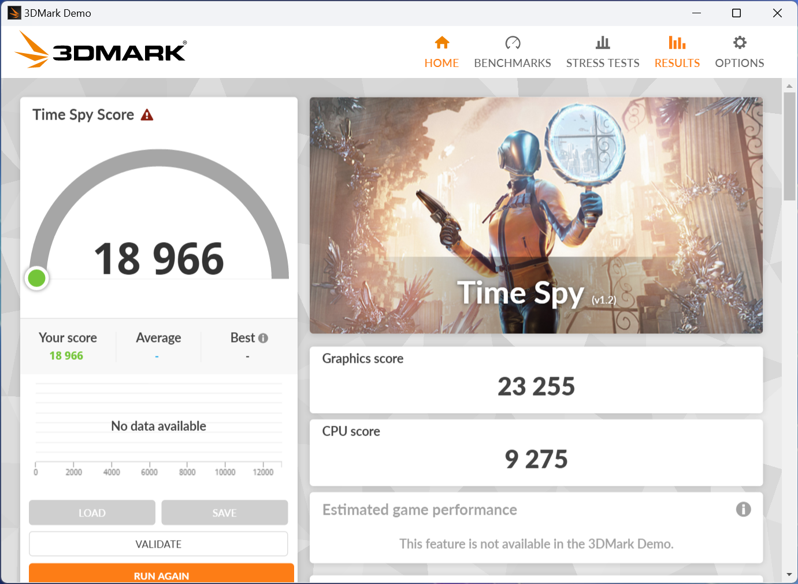](images/timespy_4070_ti_super.png)
[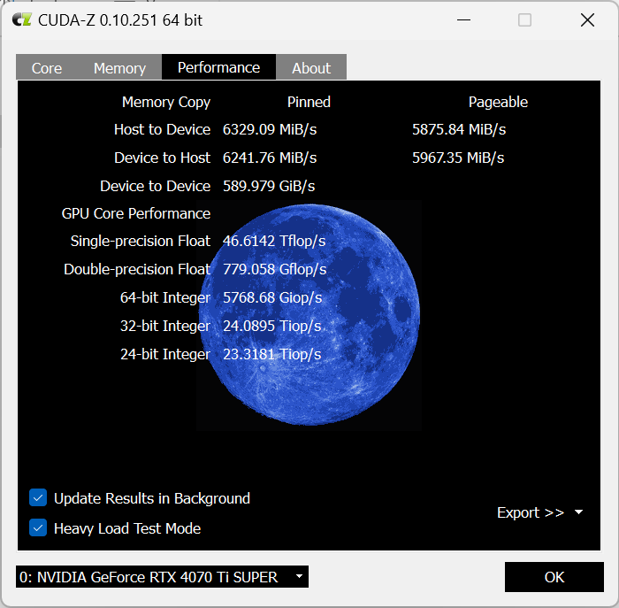](images/cudaz_4070_ti_super.png)

Some context for the Timespy graphics score (note that real world performance will often differ from benchmarks):

* It is 4% lower than the average score for 4070 Ti SUPER
* It is 15% higher than the score for the XG Mobile 4090
* It is 26% higher than the same GPU connected to an Ally X through Thunderbolt

### Thermals
The XG Station Pro's power supply is rated for 330W and the Ally charging maxes out at 60W so realistically we have 270W for the GPU (or less if USB devices are connected). Although for short bursts, it seems that the power supply was able to drive upwards of 380W without issue, that may be dangerous for long term use. We decided to undervolt the 4070 Ti SUPER to 265W which reduced performance by about 1.5%.

The XG Station Pro has two case fans but we removed one of them for space issues and we kept the other one disconnected in order to reduce power consumption (and because the fan sit behind the GPU's backplate). As a result, the case fans were not used.

At 265W, we ran FurMark for 45 minutes and there was no thermal throttling. The GPU temperatures stabilized at 70C while the outside of the case got to 47C. The power supply was around 38C. Ambient temperature was 25C.
