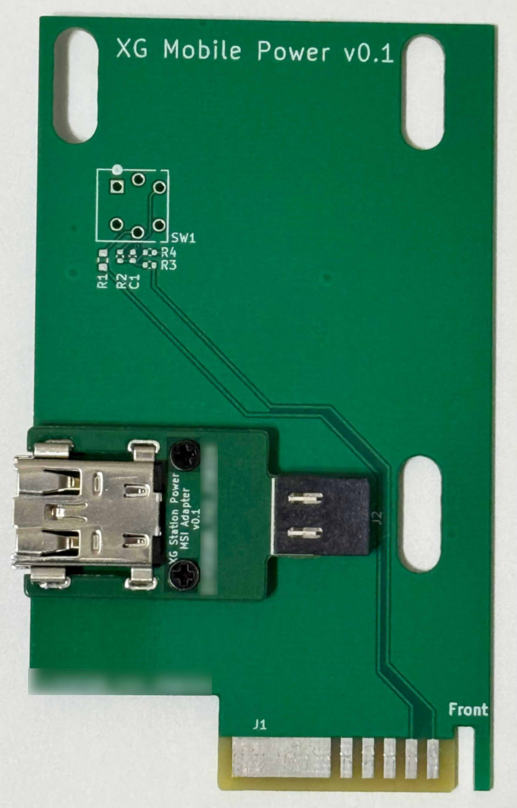
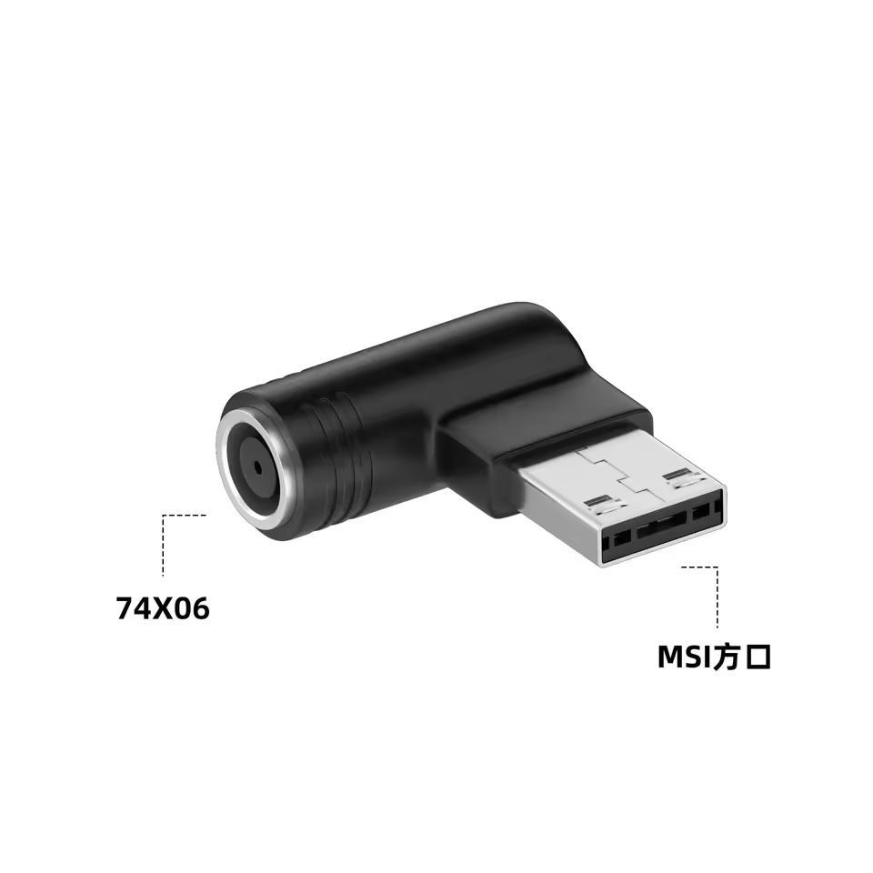

The XG Mobile Station adopts the 20P slot which mates with a daughter card that hosts a special connector that is found on the XG Station Pro's power supply. You may want to replace this card in order to use a higher wattage or smaller sized power supply or to build a custom enclosure for the XG Mobile Station without needing to source the special power supply and daughter card.

## XG Mobile Power

The custom power adapter card is built to support the MSI 8P connector, which is used on some high-end MSI laptops. Why choose another proprietary port? The first reason is that there are no "standard" DC power connector that supports 20V at > 16A. The closest is the 7.4mmx5mm barrel jack, but standard parts for this port (PJ-096H) cannot handle more than 8A. Laptop manufactures that uses this port for higher wattages use a proprietary part that does not solder directly to the PCB but instead adapts it to a custom connector. The second reason is that at the time of writing, the highest wattage AC-DC 20V power supply you can easily buy at online retailers is 400W and it uses the MSI 8P connector.

### Parts Needed

* XG Mobile Power board: go to [releases](https://github.com/osy/XG_Mobile_Station/releases) and download `GERBER-XG_Station_Power.zip`. Upload it to a JLCPCB or another manufacturer and purchase it with the default settings.
* XG Mobile Power MSI addon board: go to [releases](https://github.com/osy/XG_Mobile_Station/releases) and download `GERBER-XG_Station_Power_MSI.zip`. Upload it to a JLCPCB or another manufacturer and purchase it with the default settings.
* MSI 8P port: You can find this part on AliExpress with a title such as "MSI GP76 GP66 Charging Port USB Square Connector" for about $1 USD a piece ([example listing](https://www.aliexpress.us/item/3256806058519484.html))
* M2x8 screws
* M2 spacers: They should be 2.3mm thickness or you can stack two 1mm thick spacers ([example listing](https://www.aliexpress.us/item/2251832835568550.html)) with one 0.3mm spacer ([example listing](https://www.aliexpress.us/item/2255799988145316.html))
* M2 brass nut: The length should be at least 2mm ([example listing](https://www.aliexpress.us/item/3256804349544912.html)) 
* [TE 2351970-1 power assembly](https://www.te.com/en/product-2351970-1.html)

### Assembly

Once you have the boards, first solder the MSI 8P connector to the smaller board and the TE 2351970-1 connector to the larger board. Then place the spacer between the two boards and run the screw into the assembly. Thread it into the brass nut on underside of the board.

For XG Mobile Station, you do not need the power button (SW1) and can leave it unpopulated. If you want to use this in the original Thunderbolt 3 enclosure, you need to transfer the switch and the passives under it over from the original board to the custom board.

### 7.4mm Adapter

You can also purchase a MSI 8P to 7.4mm barrel jack adapter on AliExpress for around $5 USD ([example listing](https://www.aliexpress.us/item/3256807588959754.html)) and this will allow you to use the more common 7.4mm barrel connector. Note that you should avoid the variant which has a cable with two ends because there is no guarantee that the adapter will be able to handle the high current load.

## USB Charging

If you use a higher wattage power supply, you may wish to flash the 100W charging profile found in [releases](https://github.com/osy/XG_Mobile_Station/releases) (titled `XG_Mobile_Dock_Charger_100W.bin`). The default profile will be limited to 65W.

## Example Supplies

Here is a sample selection of high wattage supplies that you can buy on online retailers which are compatible with the XG Mobile Station. Note that any 20V supply will work but a graphics card with 2x 8-pin connectors can draw up to 300W and the USB charger can draw up to 65/100W (depending on the firmware) so you must pick a supply that can handle the load.

| Vendor | Model      | Wattage | Connector        | Adapter                    | Notes                                         |
|--------|------------|---------|------------------|----------------------------|-----------------------------------------------|
| ASUS   | ADP-330AB  | 330W    | XG Station Pro   | Stock                      |                                               |
| MSI    | ADP-400CB  | 400W    | MSI 8P           | Custom                     |                                               |
| MSI    | ADP-330GB  | 330W    | MSI 8P           | Custom                     |                                               |
| Dell   | ADP-330AB  | 330W    | 7.4mmx5mm Barrel | Custom + MSI-7.4mm Adapter | Same supply as stock, but different connector |
| Dell   | LA360PM230 | 360W    | 7.4mmx5mm Barrel | Custom + MSI-7.4mm Adapter | GaN based, small size                         |
