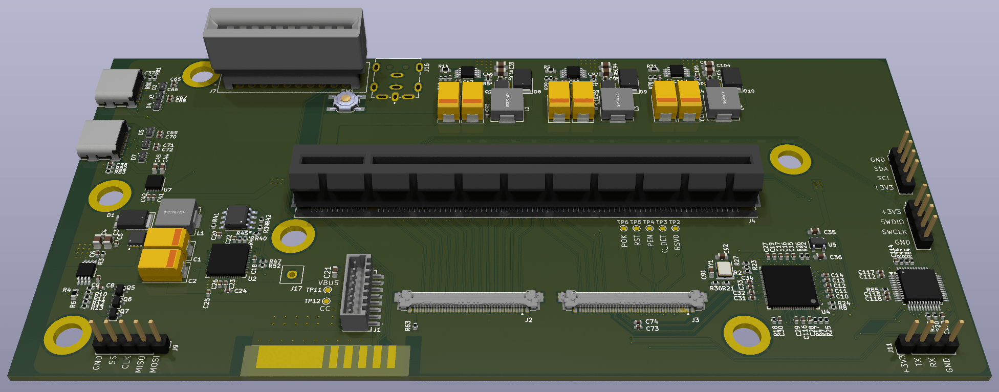

XG Mobile Station
=================

This open source hardware allows you to connect any PCIe card to an ASUS ROG device with the XG Mobile connector. It is intended to be a drop-in replacement PCB for the [XG Station Pro Thunderbolt 3 eGPU dock][1] but can also be used standalone with an external power adapter.

## Features
* PCIe 3.0 x8 support for 2022/2023 ROG Flow
* PCIe 3.0 x4 support for 2023 ROG Ally
* MCU handling cable detection and LEDs
* 100W USB PD charger
* 2 USB-C ports connected to a USB 3.1 Gen 2 hub

## Getting Started
1. [Build the PCB](Docs/Build_Guide.md)
2. [Flash the board](#flashing-firmware)
3. [Install the software](#install-xgmactivator)

### Flashing Firmware

#### STM32 MCU
1. Download `XG_Mobile_Dock_MCU.bin` from the latest release or [build your own](Docs/Build_Guide.md#mcu).
2. Download and install [ST32CubeProgrammer][2].
3. Connect your ST-LINK v2 to your computer. Note if you are using a cheap clone from Amazon or Aliexpress, the pin numbers printed on the device may be incorrect.
4. Connect the SWDIO, SWCLK, and GND pins to J10 on the board to the ST-LINK v2. Do not connect +3V3.
5. Ensure the board is powered on so it can be programmed.
6. Open ST32CubeProgrammer and go to the "Erasing & programming" page (second icon on the left sidebar).
7. Browse and select the firmware file.
8. Check "Run after programming"
9. Click "Connect" on the right sidebar and then "Start Programming" on the left.

#### SPI Flash for TI USB PD
We will be using a Raspberry Pi, although most other SBC can also work as well as dedicated SPI flashers.

1. [Enable the SPI interface on the Raspberry Pi.][3]
2. Connect GND (Ground), SS (SPI0 CE0), CLK (SPI0 SCLK), MISO (SPI0 MISO), and MOSI (SPI0 MOSI) on J9 [to the Raspberry Pi][4].
3. Open a shell to the Raspberry Pi and install Flashrom: `sudo apt-get install flashrom`
4. Download `XG_Mobile_Dock_Charger.bin` from the latest release or [build your own](Docs/Build_Guide.md#ti-pd-controller).
5. Flash the firmware: `sudo flashrom -p linux_spi:dev=/dev/spidev0.0,spispeed=1000 -w XG_Mobile_Dock_Charger.bin`

### Install XGMActivator
XGMActivator is a simple Windows service that tricks ARMORY CRATE software into identifying the custom dock as an official XG Mobile device. Once installed, it should work even if ARMORY CRATE software is updated. You can check out the [source code here](XGMActivator/XGMActivator.c).

1. Download `XGMActivator_Setup.msi` from the latest release.
2. Run the installer making sure to correctly select AMD or NVIDIA depending on the vendor of the GPU you are installing.
3. If you need to swap between AMD and NVIDIA, uninstall from Control Panel or by running the installer again. Then you can re-install and select the right option.

## Troubleshooting

### Error 43 or no video output on NVIDIA GPUs
This is a well known issue with NVIDIA eGPUs. Once the eGPU is installed along with the correct drivers, you will need to install [this script][5].

## References
Knowledge base for all things XGM gathered from reverse engineering the hardware and software.

* [XGM connector information](Docs/Connector.md)
* [XGM software interfaces](Docs/Software.md)
* [MCU command interface](Docs/MCU.md)
* [PCB design diary](Docs/Diary.md)
* [Reversed ACPI tables](Docs/ACPI_Annotated.asl)
* [Reversed BIOS detection](Docs/BIOS_Detect.c)

[1]: https://www.asus.com/motherboards-components/external-graphics-docks/all-series/xg-station-pro/
[2]: https://www.st.com/en/development-tools/stm32cubeprog.html
[3]: https://www.raspberrypi-spy.co.uk/2014/08/enabling-the-spi-interface-on-the-raspberry-pi/
[4]: https://pinout.xyz
[5]: https://egpu.io/nvidia-error43-fixer
